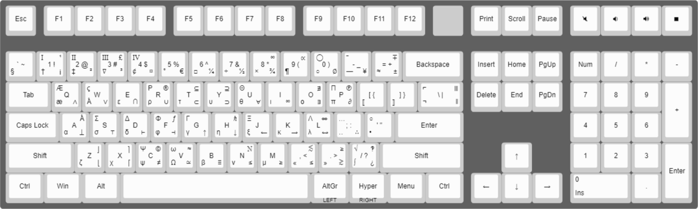

# Hypercubed QMK Userspace

This is my personal QMK userspace, a collection of keymaps and user code that I use for my keyboard.

## Overview

* Greek and Symbol Layers
* Unicode characters using HexNumpad in both Windows and MacOS with Alt-code backup for problematic characters
* Using (Keychron v6) dip switch to change unicode mode
* Compose Key (simialr to keader key) support for entering special characters

## Features

### Unicode with Alt-code overrides

The userspace uses the [qmk unicode feature](https://docs.qmk.fm/#/feature_unicode).  This userspace also includes Alt-code overrides for characters that are cause issues on Windows.  For example, the HexNumPad method for entering the `∞` (U+221E) character does not work on Windows in many applications.  The Alt-code for `∞` is `236` so this code will use the Alt-code for `∞` on Windows.

### Unicode Mode

This userspace uses the `UNICODE_MODE_WINDOWS` and `UNICODE_MODE_OSX` modes to allow for Unicode input on both Windows and MacOS.  The `UNICODE_MODE_OSX` mode is used when Keychron v6 switch is switched to "Mac".  The `UNICODE_MODE_WINDOWS` mode is used when the swicth is set to "Win".  When `UNICODE_MODE_WINDOWS` mode is active the `Alt` key overides are enabled.

### Compose Key

This userspace includes a compose key that is similar to the leader key.  The compose key (assigned to RCTRL in the included keymap) is used to enter special characters.  For example, to enter the `å` (U+0xE5) character you would press `o` `a` then `COMPOSE`.  The two typed characters are replaced with the `å` character.  To the `Å` character press `o` `a` then `SHIFT+COMPOSE`.

## Layout

[keyboard-layout-editor.com](http://www.keyboard-layout-editor.com/#/gists/912555eb0e702d68f874cf1906143ca6)

## OS Support

As mentioned [here](https://docs.qmk.fm/#/feature_unicode), "there is no “standard” method of Unicode input across all operating systems, each of them require their own setup process on both the host and in the firmware".  However, in my testing `UNICODE_MODE_WINDOWS` and `UNICODE_MODE_OSX` work ok on Windows and MacOS resepctivly.  To use these modes on MacOS and Windows you must setup the OS host as described in the [QMK documentation](https://docs.qmk.fm/#/feature_unicode?id=input-modes) (see MacOS and Windows (HexNumpad)).  I have not tested on Linux at all.

## License

Copyright 2024 J. Harshbarger @Hypercubed

This program is free software: you can redistribute it and/or modify
it under the terms of the GNU General Public License as published by
the Free Software Foundation, either version 2 of the License, or
(at your option) any later version.

This program is distributed in the hope that it will be useful,
but WITHOUT ANY WARRANTY; without even the implied warranty of
MERCHANTABILITY or FITNESS FOR A PARTICULAR PURPOSE.  See the
GNU General Public License for more details.

You should have received a copy of the GNU General Public License
along with this program.  If not, see <http://www.gnu.org/licenses/>.

