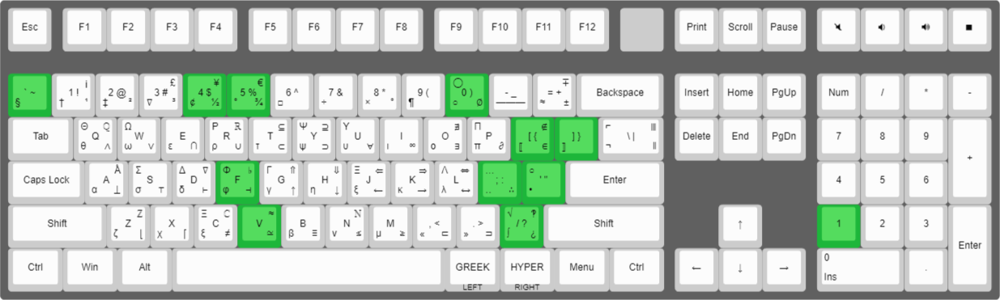

# Hypercubed QMK Userspace

This is my personal QMK userspace. It is a collection of keymaps and other QMK related files that I use for my keyboard(s).

## Layout

[keyboard-layout-editor.com](http://www.keyboard-layout-editor.com/#/gists/e796a7a562043497ed079116fce5ce15)

## License

Copyright 2024 J. Harshbarger @Hypercubed

This program is free software: you can redistribute it and/or modify
it under the terms of the GNU General Public License as published by
the Free Software Foundation, either version 2 of the License, or
(at your option) any later version.

This program is distributed in the hope that it will be useful,
but WITHOUT ANY WARRANTY; without even the implied warranty of
MERCHANTABILITY or FITNESS FOR A PARTICULAR PURPOSE.  See the
GNU General Public License for more details.

You should have received a copy of the GNU General Public License
along with this program.  If not, see <http://www.gnu.org/licenses/>.

